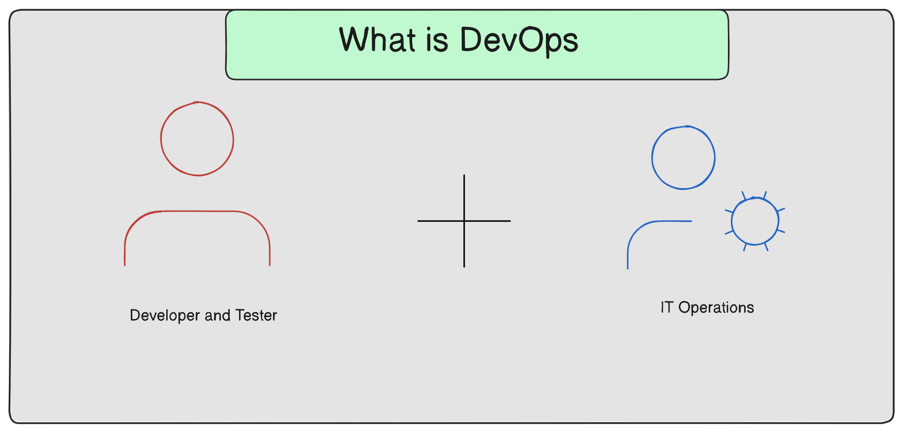
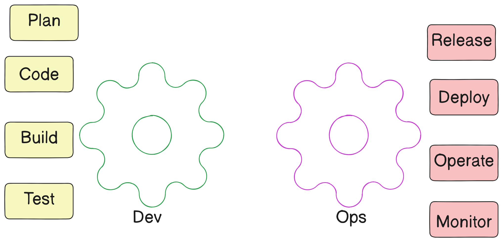

# DevOps

- The DevOps is a combination of two words, one is software Development, and Second is Operations.   
- This allows a single team to handle the entire application lifecycle from development to testing, deployment and operations. 
- DevOps helps you to reduce the disconnection between software developers, quality assurance (QA) engineers, and system adminstrators. 
- DevOps Promotes collaboration between Development and Operations team to deploy to production faster in an automated & repeatable way. 
- DevOps helps to increase organization speed to deliver applications and services. It also allows organizations to serve their customers better and compete more strongly in the market. 
---

## Why DevOps
 - The operation and development team worked in isolation
 - After the design-build, the testing and deployment are performed respectively. That's why they consumed more time than actual build cycles
 - Without the use of DevOps, the team members are spending a large amount of time on designing, testing and deploying instead of building the project
 - Manual code deployment leads to human errors in production
 - Coding and operation teams have their separate timelines and are not in sync, causing further delays.

---

## DevOps Advantages 

- DevOps is an excellent approach for quick development and deployment of applications
- It responds faster to the market changes to improve business growth
- DevOps esclate business profit by decreasing software delivery time and transportation costs
- DevOps clears the descriptive process, which gives clarity on product development and delivery.
- it improves customer experience and satisfaction
- DevOps simplifies collaboration and places all tools in the cloud for customers to access
- DevOps means collective responsibility, which leads to better team engagement and productivity. 

## DevOps Disadvantage

- DevOps professional or expert's developers are less available
- Developing with DevOps is so expensive
- Adopting new DevOps technology into the industries is hard to manage in short time
- Lack of DevOps knowledge can be a problem in the continous integration of automation projects. 
---

# DevOps Architecture

DevOps architecture is used for the applications hosted on the cloud platform and large distributed applications. Agile Development is used in the DevOps architecture so that integration and delivery can be contiguous. When the development and operations team works separately from each other, then it is time-consuming to design, test, and deploy. And if the terms are not in sync with each other, then it may cause a delay in the delivery. So DevOps enables the teams to change their shortcomings and increases productivity.

### Devops Components

- **Plan** :- DevOps use Agile methodology to plan the development. With the operations and development team in sync, it helps in organizing the work to plan accordingly to increase productivity.

- **Code** :- Many good practices such as Git enables the code to be used, which ensures writing the code for business, helps to track changes, getting notified about the reason behind the difference in the actual and the expected output, and if necessary reverting to the original code developed. The code can be appropriately arranged in files, folders, etc. And they can be reused.

- **Build** :- Without DevOps, the cost of the consumption of the resources was evaluated based on the pre-defined individual usage with fixed hardware allocation. And with DevOps, the usage of cloud, sharing of resources comes into the picture, and the build is dependent upon the user's need, which is a mechanism to control the usage of resources or capacity.

- **Test** :- The application will be ready for production after testing. In the case of manual testing, it consumes more time in testing and moving the code to the output. The testing can be automated, which decreases the time for testing so that the time to deploy the code to production can be reduced as automating the running of the scripts will remove many manual steps.

- **Release** :- Deployment to an environment can be done by automation. But when the deployment is made to the production environment, it is done by manual triggering. Many processes involved in release management commonly used to do the deployment in the production environment manually to lessen the impact on the customers.

- **Deploy** :- Many systems can support the scheduler for automated deployment. The cloud management platform enables users to capture accurate insights and view the optimization scenario, analytics on trends by the deployment of dashboards.

- **Operate** :- DevOps changes the way traditional approach of developing and testing separately. The teams operate in a collaborative way where both the teams actively participate throughout the service lifecycle. The operation team interacts with developers, and they come up with a monitoring plan which serves the IT and business requirements.

- **Monitor** :- Continuous monitoring is used to identify any risk of failure. Also, it helps in tracking the system accurately so that the health of the application can be checked. The monitoring becomes more comfortable with services where the log data may get monitored through many third-party tools such as Splunk.
---

# DevOps Lifecycle
The DevOps lifecycle includes seven phases as given below:

1. **Continuous Development:** This is where developers write and improve code continuously.

    - Example: Imagine you're working on a recipe. You keep adding new ingredients and tweaking the steps as you cook.
2. Continuous Integration: Code changes are frequently merged into a shared repository. Automated tests run to check if everything works together.

    - Example: Like having a group of friends add their ingredients to a big pot. You check if the soup tastes good each time someone adds something new.
3. **Continuous Testing:** Automated tests check the code to find bugs before it’s released.

    - Example: Tasting the soup after each new ingredient to ensure it’s still delicious and not too salty or spicy.
4. **Continuous Monitoring:** After the application is live, it’s constantly monitored for performance and issues.

    - Example: Keeping an eye on the soup pot to make sure it doesn’t boil over or burn.
5. **Continuous Deployment:** Code changes that pass tests are automatically deployed to production.

    - Example: Once the soup is ready and tastes perfect, you serve it to your guests without delay.
6. **Continuous Operations:** Ensures the application runs smoothly in production, addressing issues as they arise.

    - Example: If the soup starts to cool down, you quickly reheat it so your guests can enjoy it hot.

7. **Continuous Feedback :** This involves gathering feedback from users and stakeholders about the application, which informs future development and improvements.

    - Example: After serving the soup, you ask your guests how they liked it and if they have any suggestions for next time. Their feedback helps you make the recipe even better in the future.