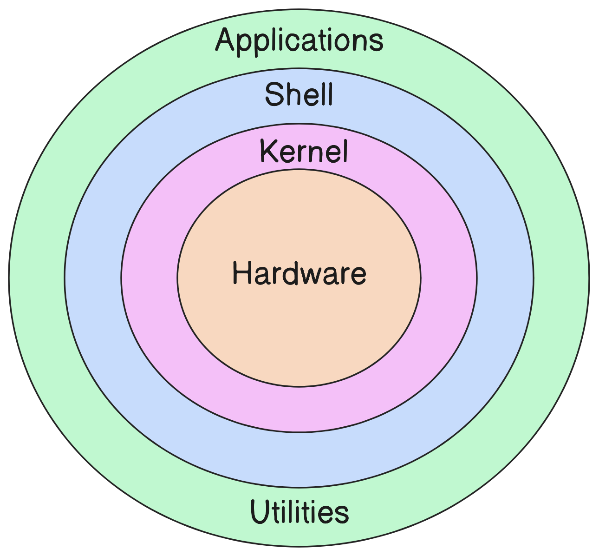
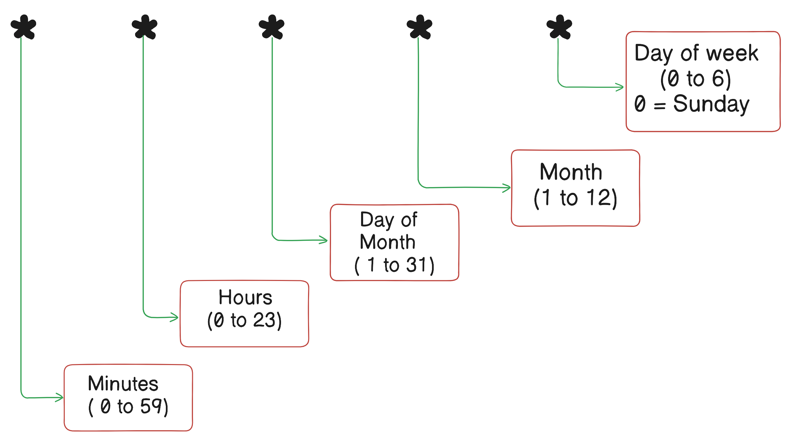
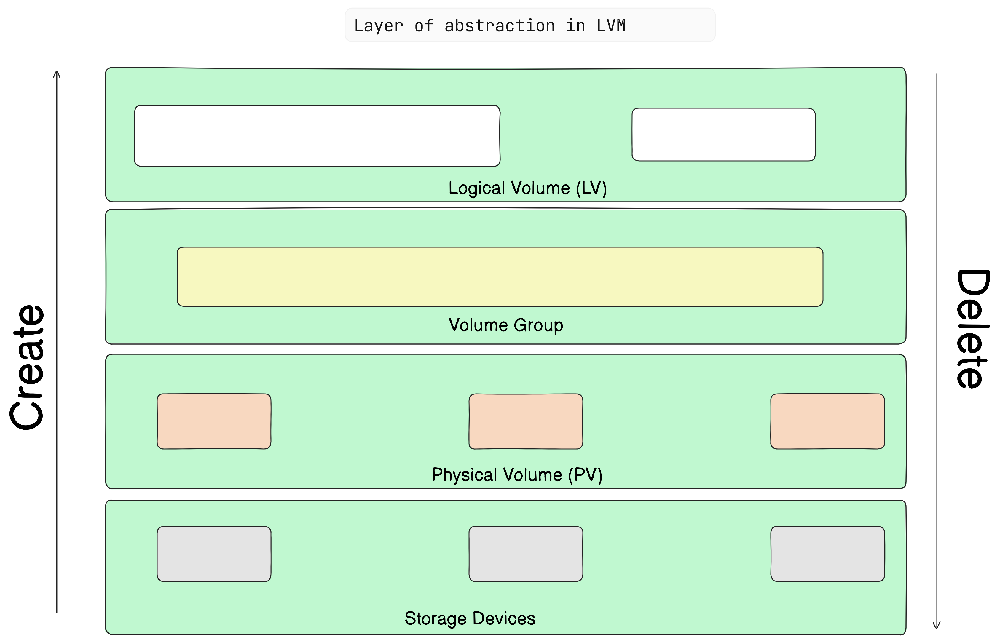

# Linux

- Linux is an open-source operating system based on Unix
- It is known for its security, flexibility.

## History of Linux
- Created by Linus Torvalds in 1991.
- The name **"Linux"** comes from Linus + Unix.

## Unix 
Unix is a powerful, multicluster, multitasking operating system originally developed in the 1970s at AT&T's Bell Labs, Which serves as the foundation for many modern operating systems. 

## Linux vs Unix 
 Unix is licensed and Linux is Open Sourced. 

Linux is inspired by Unix and is designed to be Unix-like. It follows many of the same principles and standards, making it compatible with Unix software and commands. 

## Linux is not an OS 

- Linux is an open-source kernel. 
- A kernel is the core part of an operating system, managing system resources and communication between hardware and software. 

## Linux Distributions (Distros)

An operating system made from a software collection which includes the linux kernel and often a package management system.   
for ex :-   
- Ubuntu  
- RedHat OS  
- CentOS

## Key features of linux
* **Open Source:** Source code is freely available and can be modified.
* **Multiuser:** Multiple users can access system resources simultaneously
* **Multitasking** Can run multiple tasks simultaneously.
* **Security** Strong security features and regular updates. 
* **Portability** Can run on various hardware platforms. 
---
# Access Linux servers/Machine using SSH

we can use SSH (Secure shell) to acccess linux machine remotly 

**Command :-** `ssh user@IP_Address`  
- for example :- let's say we want to access a ubuntu server with user gautam whose IP address is 5.99.154.2  
- then we can use command `ssh gautam@5.99.154.2`
---
# Copy file from One Server to Another

- We can use scp or rsync to copy file from one server to another.  
- `scp` and `rsync` are both powerful commands for transferring files between servers over a network, but they have some differences in functionality and use cases. 
---
1. `scp` (Secure copy protocol)  
scp is a basic command to securely copy files and directories from one machine to another over SSH. It’s simple to use but doesn’t support advanced features like incremental file transfers.
**Syntax**   
`scp [options] source_file [user@]host:destination_path`

**Common Options**
* -r: Recursively copy directories.
* -P port: Specify the SSH port to use.
* -C: Enable compression during transfer.
* -i identity_file: Specify the SSH key file.

**Examples** 
1. Copy a file to a remote server   
`scp file.txt user@remote_host:/remote/directory`

2. Copy a directory to a remote server  
`scp -r /local/directory user@remote_host:/remote/directory`

3. Copy a file from a remote server to the local machine  
`scp user@remote_host:/remote/file.txt /local/directory`  

4. Use a specific SSH port  
`scp -P 2222 file.txt user@remote_host:/remote/directory`
---

2. `rsync` (Remote Sync)  
`rsync` is a more flexible command for copying and syncing files and directories. It supports incremental transfers, meaning it only transfers the changed parts of files, which saves time and bandwidth.

**Syntax**  
`rsync [options] source [user@]host:destination`

**Common Options**
* -r: Recursively copy directories.
* -a: Archive mode, preserving permissions, timestamps, symbolic links, etc.
* -v: Verbose mode.
* -z: Enable compression during transfer.
* --progress: Show progress during transfer.
* -e ssh: Use SSH for data transfer.
* --delete: Delete files on the destination that don’t exist on the source.

**Examples** 

1. Copy a file to a remote server  
`rsync -avz file.txt user@remote_host:/remote/directory`
2. Copy a directory to a remote server with progress shown  
`rsync -avz --progress /local/directory user@remote_host:/remote/directory`
3. Copy from a remote server to the local machine  
`rsync -avz user@remote_host:/remote/file.txt /local/directory`
4. Sync a directory and delete files on the destination that don’t exist on the source  
`rsync -avz --delete /local/directory/ user@remote_host:/remote/directory/`
---

# Architecture of Linux 


1. **Hardware** 
    - The hardware is the physical part of the computer, like the CPU, memory, hard disk, and network interface. This is the base layer of the system.
    - All other layers depend on the hardware to perform any actions, whether it's processing data, storing files, or connecting to a network.

2. **Kernel** 
    - The kernel is the core of the Linux operating system. It's the layer that interacts directly with the hardware.
    - Think of the kernel as the "manager" of your hardware. It decides how to use system resources like CPU time, memory allocation, and device input/output.
    - Key functions of the kernel include:
        * **Process Management:** Controls and manages processes.
        * **Memory Management:** Allocates and deallocates memory to different applications.
        * **Device Management:** Manages communication between software and hardware.
        * **System Calls and Security:** Acts as a bridge between the hardware and applications, providing a safe way for applications to use hardware resources.

3. **Shell**
    - The shell is the interface between the user and the kernel. It takes commands from the user and translates them into actions that the kernel understands.
    - When you type commands in the terminal, you’re interacting with the shell. Popular shells include Bash, Zsh, and Fish.
    - The shell can be thought of as the "command-line interpreter." It interprets the user’s commands and instructs the kernel to perform specific tasks.
4. **Applications and Utilities**
    * These are the programs you use, like text editors, web browsers, file managers, and development tools.
    * In Linux, most of these applications and utilities interact with the kernel via the shell or directly through system calls.
    * They’re built on top of the shell and kernel and rely on them to function properly. Many utilities are small, specialized programs that do one task well (such as `grep` for searching text or `ls` for listing files).

## Putting it all together
Here’s how these layers work together when you perform a task, like listing files:

1. You type ls in the shell.
2. The shell interprets this as a request to list files and asks the kernel to access the file system.
3. The kernel communicates with the hardware to read data from the hard disk.
3. The application (in this case, ls) displays the output in the terminal.

Each layer depends on the one below it, creating a robust and modular system that makes Linux flexible and powerful!

---
# Linux Boot process
The Linux boot process is the sequence of steps your computer goes through to startup Linux.

1. **Power On / BIOS or UEFI**
    * When you press the power button, the computer first runs the **BIOS** (Basic Input/Output System) or UEFI (Unified Extensible Firmware Interface).
    * The BIOS/UEFI performs a **POST** (Power-On Self Test) to check that the hardware (like memory, CPU, Keyboard) is working correctly.
    * After the hardware check, BIOS/UEFI finds a bootable device (like hard drive) and hannds control over to the bootloader program on that device. 

2. Bootloader (GRUB)
    * The bootloader is a small program that helps load the operating system. Most Linux systems use GRUB (GRand Unified Bootloader) as the bootloader.
    * GRUB shows you a menu where you can choose an operating system if you have multiple OSes installed, or different kernel versions if available.
    * Once an option is selected, GRUB loads the chosen Linux kernel into memory and starts it.

3. Linux Kernel
    * The kernel is the core of the Linux operating system. Once loaded into memory, the kernel takes control of the system.
    * It initializes all hardware components, like CPU, memory, and disk drives, making them ready for the OS to use.
    * The kernel also mounts the root filesystem (the main directory structure of your Linux installation) so it can access essential files.
4. init Process / systemd
    * After initializing the hardware, the kernel starts the init process (or systemd on most modern systems). This is the first process in Linux and has a PID (Process ID) of 1.
    * systemd is responsible for starting and managing system services, like network managers, loggers, and other essential services that need to run in the background.
    * systemd reads configuration files to determine which services to start based on the selected target (like multi-user mode, graphical mode, etc.).
5. Runlevel / Targets
    * **Targets** (also called **runlevels** in older systems) define the operating state of the system. Examples include:
        - **Multi-user** (without a GUI) for server environments.
        - **Graphical** (with a GUI) for desktop environments.
    * systemd starts all services associated with the chosen target. If it's a graphical target, it starts the **display manager** (like GDM or LightDM) for the login screen.
6. Login Screen and User Space
    * Once all required services are up and running, you see a **login prompt** or **graphical login screen**.
    * After you log in, the system loads your **user environment**, which includes your desktop environment or command-line shell, and you’re ready to use your system.

## Summary of Steps:
1. Power On → BIOS/UEFI
2. BIOS/UEFI → Bootloader (GRUB)
3. Bootloader → Linux Kernel
4. Kernel → systemd/init
5. systemd/init → Target/Runlevel
6. Target → Login Prompt / User Space

---

# Directory Structure
The Linux directory structure might seem complex at first, but each directory has a specific purpose.

## Root Directory (`/`)
* At the top of the Linux file system is the root directory, represented by a single slash /.
* All files and directories are located under /, making it the starting point of the Linux file structure.

### Key Directories under `/`

1. `/bin` (Binary)

* Contains essential user binaries (programs) like `ls`, `cp`, `mv`, and `cat`.
* These are common commands used by all users and available even in single-user mode (for system recovery).
2. `/boot`

* Holds files needed for booting the system, including the Linux kernel and GRUB bootloader files.
* This is where the initial files needed to load the operating system are stored.
3. `/dev` (Device Files)

* Contains device files that represent hardware components, like hard drives (/dev/sda), USB drives, and printers.
* By using these files, Linux treats hardware as files, making it easier for applications to interact with hardware.

4. `/etc` (Configuration Files)

* Stores system configuration files for the entire system. Examples include configuration files for networking, user accounts, and services.
* Common files here are /etc/passwd (user accounts) and /etc/fstab (filesystem mounting).
5. `/home`

* Contains user home directories, where each user has a separate folder (/home/username).
* Users store their personal files, documents, downloads, and configurations here.
6. `/lib` (Libraries)

* Contains essential system libraries needed by programs in `/bin` and `/sbin`.
* Libraries are like helper files that programs use to perform common tasks.
7. `/media`

* Used to mount external removable media like USB drives and CDs/DVDs.
* When you plug in an external drive, it typically appears here (e.g., `/media/username/drive_name`).
8. `/mnt`

* Another directory used for temporarily mounting filesystems.
* Often used by system administrators to mount external storage or partitions manually.
9. `/opt` (Optional)

* Stores optional software packages and third-party applications that are not part of the default Linux system.
* Often used for manually installed software that doesn’t come through the system’s package manager.
10. `/proc` (Process)

* A virtual filesystem that holds runtime system information about processes and system resources.
* For example, `/proc/cpuinfo` shows CPU details, and `/proc/meminfo` shows memory usage.

11. `/root`

* This is the home directory for the root (superuser) account.
* Different from /home, this directory is specific to the root user.
12. `/run`

* Stores runtime data like PID files, user session information, and other temporary files that don’t need to be preserved after a reboot.
13. `/sbin` (System Binaries)

* Contains essential system binaries used by the system administrator for system management.
* Examples include `fdisk`, `mkfs`, and `ifconfig`.
14. `/srv` (Service)

* Holds data for services provided by the system, such as web servers or FTP servers.
* If your system is hosting a website or FTP server, those files might be found here.
15. `/tmp` (Temporary)

* A directory for temporary files created by applications or users.
* Files here are usually deleted automatically after a reboot to free up space.
16. `/usr` (User Programs)

* A large directory containing user applications and utilities.
* Inside /usr, you’ll find:
    * /usr/bin: Non-essential user programs (e.g., editor, browser).
    * /usr/sbin: Non-essential system administration binaries.
    * /usr/lib: Libraries for programs in /usr/bin and /usr/sbin.
    * /usr/local: Locally installed software (software installed manually by the user).

17. `/var` (Variable)

* Stores files that change frequently, like logs, cache, spool files (email), and databases.
* Important subdirectories include:
    - `/var/log`: System log files, which are helpful for troubleshooting.
    - `/var/www`: Web server files for hosting websites.

---
# `vi` Editor

- It is a command based editor
- It stands for visual editor

**3 Modes of Vi editor**
- Command mode
- Insert mode
- Exit mode

**Commands for Vi Editor**
1. Editing files
    - `i` :- Insert text before current cursor
    - `I` :- Insert text at begining of current line
    - `a` :- Insert after current cursor
    - `A` :- Insert at the end of current line. 

2. Deleting Character 
    - `x` :- Delete current cursor location character
    - `X` :- Delete character before cursor
    - `dw` :- Delete word from urrent cursor
    - `d^` :- Delete from current cursor to begining
    - `d$` :- Delete from current cursor to end
    - `D` :- delete from current cursor to end of line
    - `dd` :- Delete the line where cursor is.

3. Moving in file
    - k ----> up
    - j ----> down
    - h ----> left
    - l ----> right 

Although we can simply use arow keys

4. Search and replace 
    - `:s/<search key>/<replace key>`
5. Copy and paste commands
    - `yy` :- copy current line
    - `yw` :- copy from current cursor to end of the word
    - `p` :- Paste copied text after cursor
    - `P` :- paste copied text before cursor

---

# User and Group Mgmt Commands

1. Create user
- `useradd <user name>`
2. Delete user
- `userdel <user name>`
3. Change password of user
- `usermod -p '<new password' <user name>`
4. Put user into the group
- `usermod -G <group name> <user name>`
5. Set Password to current user
- `passwd`
6. Set password of another user
- `passwd <user name>`
7. Create a Group
- `groupadd <group name>`
8. See the list of groups the current user in
- `groups`
9. Delete a group
- `groupdel <group name>`

10. Change owner of a file
- `chown <owner name> <file name>`
11. Change group owner of a file
- `chgrp <group name> <file name>`

---

# Filter Commands

Filter commands display the content as per the requirement of the user. But the changes are not saved on original file

Some Commands :- 
1. `cat -n <file name>` :- Display number of files along with content
2. `cat -e <file name>` :- It is used to display the contents of a file with some special formatting:

    * The -e option in cat does two things:

        - It displays end-of-line characters as $. This makes it clear where each line ends, which is helpful for identifying trailing spaces or checking line endings.
        - It shows non-printing characters, such as tab and newline, in a visible format.
3. `tac <file name>` :- Display content from last line to first line.
4. `wc` :- wc stands for word count and it counts the number of lines, words and character.
5. `wc -c` :- It counts the number of character
6. `wc -l` :- count the number of lines
7. `wc -w` :- count the number of words
8. `nl` :- it display the no. of lines with the content like `cat -n` do.
9. `cut` :- It cut out the content and display it, for example if we want to display first character of each line
10. `cut -c 1 <file name>` :- It cuts the first character of each line and display it
11. `cut -c 1-3 <file-name>` :- It cuts first 3 character of each line
12. `cut -c 1,4 <file-name>` :- It cuts the first and 4th character of each line
13. `tee` :- It is used to append data in file and also show you the data you appended.
14. `tee -a <file name>` It is used to append the data to file insted of overwriting it.
15. `|` (pipe) :- It combines 2 commands and the output for 1st command act as input of 2nd command.
    - `wc -c <file name> | tee -a <file name>`
16. `tr` :- tr means translate
17. `tr [:lower:] [:upper:]` or `tr [a-z] [A-Z]` :- Both these commands translate lowercase letter to Uppercase letters
    - `cat <file name> | tr [:lower:] [:upper:]`
18. `tr '{}' '()'` :- It converts the curly brackets to round brackets
19. `tr [:space:] '\t'` :- It converts space to tab
20. `tr -d 'w'` :- delete the character
21. `tr -s 'e'` :- The -s (squeeze) option tells tr to replace sequences of repeated characters with a single occurrence of that character.
22. `tr -d [:digit:]` :- delete all the digits
23. `sort -d <file name>` :- It sorts the data in dictionary order 
24. `sort <file name>` :- It also sorts the data in dictionary order
25. `sort -r <file name>` :- It sorts the data in reverse dictionary order
26. `sort -r <file1> -o <file2>` :- It reverse sort the data of file1 and save it in file2
27. `sort -n <file name>` :- sort numeric data of file in dictionary order
28. `sort -b <file name>` :- sort the content ignoring  blank space
29. `sort -f <file name>` :- sort the content ignoring lower case and uppercase

30. `uniq` :- It is used to filter out or process duplicate lines in a sorted file or input.
31. `uniq -U` :- The -U option only prints unique lines (lines that appear only once in the input).
32. `uniq -d` :- The -d option only prints duplicate lines (lines that appear more than once in the input).
33. `uniq -c` :- The -c option prefixes each line with the number of times it appears in the input.
34. `uniq -D` :- The -D option prints all occurrences of duplicate lines (not just one or two instances) along with each duplicate instance.
---

# Compress and archiving Commands

**Zipping commands based on algo** 
1. zip command is based on LZ77 algorithm
2. gzip command is based on DEFLATE algorithm
3. bzip command is based on Burrows-Wheeler algorithm

**Differences between these** 
- Zip command can combine multiple files and compress them and  it can be used in linux and non linux OS. use of zip is we allow cross platform (operating system) files to be shared
- Unlike zip, which creates an archive and compresses it, gzip and bzip2 only compress individual files. To create a compressed archive with multiple files, tar is often used in combination with gzip or bzip2 (e.g., tar -czf for gzip or tar -cjf for bzip2).

**Extensions of compressed files**
1. zip :- .zip
2. gzip :- .gz
3. bzip2 :- .bz2

**zip syntax**
- `zip compressed.zip <files list>`
- `zip compress.zip <dir names>`

**Unzip syntax**
- `unzip compress.zip`

**List the content of compressed file withing zip**
- `unzip -l compressed-file.zip`

**gzip syntax**
- `gzip <file name>`

**Ungzip**
- `gunzip <filename.gz>`

**If we want to compress multiple files with gzip**
we can just read the content from files the use pipe and gzip it in another file.  
    - `cat <file1> <file2> | gzip > final-file.gz`

**bzip**
- `bzip2 <file-name>`
- `bunzip2 <filename.bz2>`

## Archive the files

- To archive the files we have tar commands
- It stands for tape archive
- Archive files are composed of one or more files along with metadata
- Used for easier portability and less storage.
- Majorly used for taking backups

**Options for tar**
- `-c` :-  Create archive from a file or directory.
- `-x` :- Extract archive
- `-r` :-  Append file to archive
- `-t` :- List the content to archive
- `-z` :- Compress with gzip command
- `-j` :- Compress with bzip2 command
- `-v` :- Show the progress of archive files
- `-f` :- Filename of archived file

**Some Examples**
1. Create an archive 
- `tar -cvf archive.tar <file1> <file2>`
2. List archive files
- `tar -tvf archive.tar`
3. Extract the archive
- `tar -xvf archive.tar`
4. Append the file in archive
- `tar -rvf archive.tar <file3>`
5. Archive and compress with gzip
- `tar -czvf archive.tar.gz <file1> <file2>`
6. Archive and compresss with bzip2
- `tar -cjvf archive.tar.bz2 <file1> <file2>`

---
# Process (ps) commands
1. List the process along with info 
- `ps`
2. List process of all user
- `ps -a`
3. Extended version of process command 
- `ps -e`
4. Full version of process command
- `ps -f`
---
# at command

We can schedule a process to run at particular time using `at` command.

**Syntax** `at time date command`

**Examples**

1. Execute a process now
`echo "hi" | at now`
2. Schedule a process after 10 min
`echo "Hello" | at now + 10 min`
3. We can also schedule a process at certain time
- `at hh:mm am/pm`
- `at hh:mm`
4. We can also schedule a process at certain time and date
- `at 10:15 AM Apr2`
- `at 10:15 AM 4/2`
- `at 10:15 AM 4/2/2025`
- `at 10:15 AM 2.4.25`

5. Instead of explicitly defining date and time we can give identities also.
- `at now`
- `at now + 10 min`
- `at now + 10 hours`
- `at now + 10 week`
- `at now + 10 month`
- `at wednesday`
- `at november`
- `at today`
- `at noon`
- `at tomorrow`

6. `atq` :- This command list all the schedule process
7. `atrm jobno.` :- This command removes the scheduled process.

---

# cronjobs

- cron is a software utility which is also known as cronjob is a time based job scheduler.
- Users Who want to set up and maintain software environment uses cron to schedule jobs to run priodically at fixed times, days, dates, or interval.

**crontab**

- used to schedule commands to be executed periodically.
- crontab uses a daemon called crond which keeps running in background and checks once a minute to see if any of the scheduled jobs need to be executed.

**commands**
- `crontab -l` :- To show list of all current jobs.
- `crontab -e` :- To edit or add new jobs
- `crontab -r` :- To remove the job.

## cronjob syntax and format

**Syntax** 
- `* * * * * command`  :- all these 5 start is for representing Schedule expression

**Schedule Expression**


**Some Symbols to use in crontab**
`,` :- For seperation
`/` :- repetition
`-` :- range

**Some Examples**

1. `0 17 6 4 3 ls` :- Here ls command will execute at 5PM, 6th day of month, at april, on wednesday.

2. `0 17-18 6 4 3 ls` :- execute ls between 5PM to 6PM

3. `0 5,17 6 4 3 ls` :- execute ls at 5PM and 5 AM

4. `* * /1-31 * * ls` :- execute ls on repetition from day 1 to 31 of month

If we hadn't put `/` then it will execute task between day 1 and 31 one time at any day. 

--- 

# Systemd services

## What is Systemd?
Systemd is a system and service manager for Linux. It’s the first process started by the Linux kernel when the system boots, taking over from init, the traditional init system, to initialize and manage services and resources. Systemd organizes and runs all processes as units, which allows it to manage resources more flexibly and efficiently

## Why Do We Need Systemd?

Systemd simplifies booting and managing services by:

1. Parallelizing Service Starts: Starts services in parallel to speed up the boot process.
2. Dependency Management: Services can be defined with dependencies, helping ensure they start in the right order.
3. Unified Configuration and Management: All service configuration files are in one place, under `/etc/systemd/system`.
4. Centralized Logging: Logs all service output in `journalctl`, simplifying monitoring and troubleshooting

## Key Components of Systemd

- **Units:** A generic term for any service, socket, device, mount point, or other resource managed by systemd.
- **Service Units:** The `.service` files that define services.
- **Targets:** A way to group units, similar to run levels in the old init system, like `multi-user.target` or `graphical.target`.
- **Journal:** A logging component that provides logs for everything managed by systemd.

## Basic Commands in Systemd

1. Starting a Service:
- `sudo systemctl start <service-name>`

2. Stopping a Service:
- `sudo systemctl stop <service-name>`

3. Restarting a Service:
- `sudo systemctl restart <service-name>`

4. Enabling a Service at Boot:
- `sudo systemctl enable <service-name>`

5. Disabling a Service from Starting at Boot:
- `sudo systemctl disable <service-name>`

6. Checking the Status of a Service:
- `sudo systemctl status <service-name>`

7. Viewing Logs for a Service:
- `sudo journalctl -u <service-name`

## Use Case: Creating a Systemd Service

To create a custom service, you’ll need to create a `.service` file in `/etc/systemd/system/`. For example, let’s create a service for a simple Python script.

**Steps** 
1.  Create the Python Script

- Create a simple script to serve as our example. Save this as /usr/local/bin/hello.py:

```python
#!/usr/bin/env python3
import time

while True:
    print("Hello from systemd service!")
    time.sleep(5)

```
- Make the script executable:
`sudo chmod +x /usr/local/bin/hello.py`

2. Create the Systemd Service File
- Create a new file in `/etc/systemd/system` called `hello.service`:
`sudo vi /etc/systemd/system/hello.service`

- Add the following content:
```bash 
[Unit]
Description=Hello Python Systemd Service
After=network.target

[Service]
ExecStart=/usr/local/bin/hello.py
Restart=always
User=root

[Install]
WantedBy=multi-user.target
```

Here’s a breakdown of the file sections:

- **[Unit]:** Defines the service’s metadata and dependencies.

    * `Description:` A brief description.
    * `After:` Specifies when the service should start (after network.target in this case).
- **[Service]:** The service settings.

    * `ExecStart:` The command to start the service.
    * `Restart:` Defines the restart behavior. always restarts the service if it fails.
    * `User:` The user account to run the service. Here, it's root, but you can specify another user.
- **[Install]:** Defines when the service should run.

    * `WantedBy:` Specifies that the service should start in multi-user mode (non-graphical).

3. Enable and Start the Service  
Now that the service file is in place, we need to enable and start it.

- **Reload Systemd Daemon:** This is necessary to make Systemd recognize the new service file.
`sudo systemctl daemon-reload`
- **Enable the Service**
`sudo systemctl enable hello.service`
- **Start the Service:**
`sudo systemctl start hello.service`
- **Check the Status:**
`sudo systemctl status hello.service`

## Summary of commands 

| Command                          | Description                                    |
|----------------------------------|------------------------------------------------|
| `sudo systemctl start <service>` | Starts the specified service                   |
| `sudo systemctl stop <service>`  | Stops the specified service                    |
| `sudo systemctl restart <service>` | Restarts the specified service               |
| `sudo systemctl enable <service>` | Enables the service to start on boot          |
| `sudo systemctl disable <service>` | Disables the service from starting on boot   |
| `sudo systemctl status <service>` | Shows the current status of the service       |
| `sudo journalctl -u <service>`   | Shows logs for the specified service           |


Systemd is an incredibly powerful tool for managing services, with additional capabilities like setting environment variables, configuring timeouts, setting resource limits, and isolating services in a chroot environment. This approach gives administrators fine-grained control over the Linux system and services.

---

# LVM (Logical Volume Manager)

- LVM stands for **Logical Volume Manager** 
- LVM introduces extra layer of abstractionon disk present on those linux system and file system present on those disks.

### Use of LVM 
- We can create filesystem that can extend across multiple storage devices with LVM, we can agggrigate multiple storage devices into a single logical volume.
- LVM allows you to extend or shrink filesystem in realtime while data is online and fully accesssible without LVM we have to format the storage devices.
- We can give LVM a  nome of our choice.

### Layer of abstraction in LVM 



### LVM commands
1. Create physical volume
- `pvcreate /dev/vdb1 /dev/vdb2 ...`
2. Display created physical volume
- `pvs`
- `pvdisplay`
3. Display only particular physical volume
- `pvdisplay /dev/vdb1`
4. Create volume Group
- `vgcreate vg1 /dev/vdb1 /dev/vdb2`
5. Create volume group of particular size 
- `vgcreate -s 2G /dev/vdb1`
6. Display volume group 
- `vgs`
- `vgdisplay`
7. Extend volume group
- `vgextend vg1 /dev/vdb1`
8. Remove a volume group
- `vgremove vg1`
9. Create Logical Volume 
- `lvcreate -L 10G vg1 -n lv1` :- Capital **"L"** is used to give actual size of logical volume.
- `lvcreate -l 10 vg1 -n lv2` :- Small **"l"** is used to create Logical volume of size given in  percentage of volume group.

10. Extend the Logical volume
- `lvextend -L +100M /dev/vg1/lv1`
11. reduce the Logical Volume
- `lvreduce -L -110M /dev/vg1/lv1` :- 100Mb is reduced from the logical volume.
- `lvreduce -L 100M /dev/vg1/lv1` :- Shrinked to 100Mb
12. Remove the logical volume
- `lvremove /dev/vg1/lv1`

